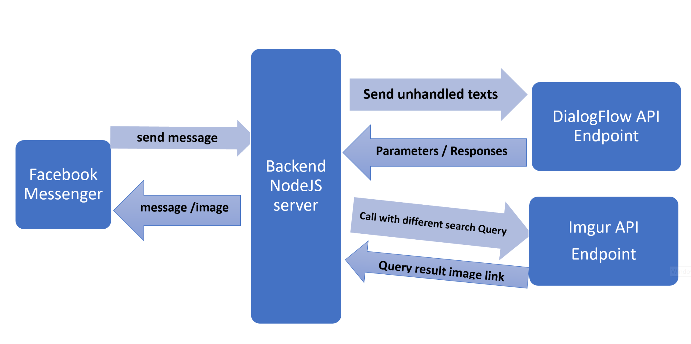

# Messenger Platform Chatbot sends memes Using DialogFlow API and Imgur API -- node.js

This project is built on the top of Messenger Platform Test drive example built in Node.js (https://developers.facebook.com/docs/messenger-platform/getting-started/test-drive/?testdrive_messengerbot=true)

With this app, you can send it messages and it will respond with images or plain text back to you. You can also test its live version using the Messenger platfrom [Live Version](https://www.messenger.com/t/MemesBuddy1) using Keywords like "Send meme" or "memes" or any other related sentences.

It contains the following functionality:

* Basic Sending Functions(Text,Image,Quick Reply)
* Imgur Search from Gallery API (https://apidocs.imgur.com/#7dde894b-a967-4419-9be2-082fbf379109)
* Imgur get images from certain account
* DialogFlow DetectIntent to Handle unexpected messages.

## Architecture

## Setup

PLEASE FOLLOW FACEBOOK DOCUMENTATION IN TEST DRIVE FOR MORE DEATILS. Any extra node modules are avaiable with the dependencies file  modificiation.

Set the values in `config/default.json` before running the sample. Descriptions of each parameter can be found in `app.js`. Alternatively, you can set the corresponding environment variables as defined in `app.js`.

Replace values for `APP_ID` and `PAGE_ID` in `public/index.html`.

## Run

You can start the server by running `npm start`. However, the webhook must be at a public URL that the Facebook servers can reach. Therefore, running the server locally on your machine will not work.

You can run this example on a cloud service provider like Heroku, Google Cloud Platform or AWS. [Gudie Video for Heroku](https://youtu.be/bUwiKFTvmDQ?t=552).

## Webhook

All webhook code is in `app.js`. It is routed to `/webhook`. This project handles callbacks for authentication, messages, delivery confirmation and postbacks. More details are available at the [reference docs](https://developers.facebook.com/docs/messenger-platform/webhook-reference).

## Files Usage

* app.js -> index file
* JWT.js -> generate the JWT signature to use it in DialogFlow calls
* PrivateKey.Key -> Includes the private key only that extracted from Service app created in google cloud platform
* inputMemory.json -> Program memory file used in (Send More Function) to save user previous choice and search word
* config/SecretKeys.json -> Stores All the sensitive credentials that you'll need to access the used APIs.  

## "Send to Messenger" and "Message Us" Plugin

An example of the "Send to Messenger" plugin and "Message Us" plugin are located at `index.html`. The "Send to Messenger" plugin can be used to trigger an authentication event. More details are available at the [reference docs](https://developers.facebook.com/docs/messenger-platform/plugin-reference).

I honestly didn't touch it .. but You might find it helpful :) 

## Expected Problems and Solutions, Main points and Important links 

You may find my personal experience in this app helpful. Follow the article below for more details.

[MEMES CHATBOT IN A NUTSHELL](https://medium.com/@khaledbnmohamed/facebook-memes-chatbot-in-a-nutshell-ceeeb423ab1b?fbclid=IwAR1Qd5YPOmQgY9Q3buZRAWzOX-rvHeGvg0kCbCej96YBEQOdt2f4QNLBfDs)

[PostgreSQL REST API to Heroku]https://www.taniarascia.com/node-express-postgresql-heroku/

[getting-started-with-sequelize-and-postgres-emp]https://dev.to/nedsoft/getting-started-with-sequelize-and-postgres-emp
